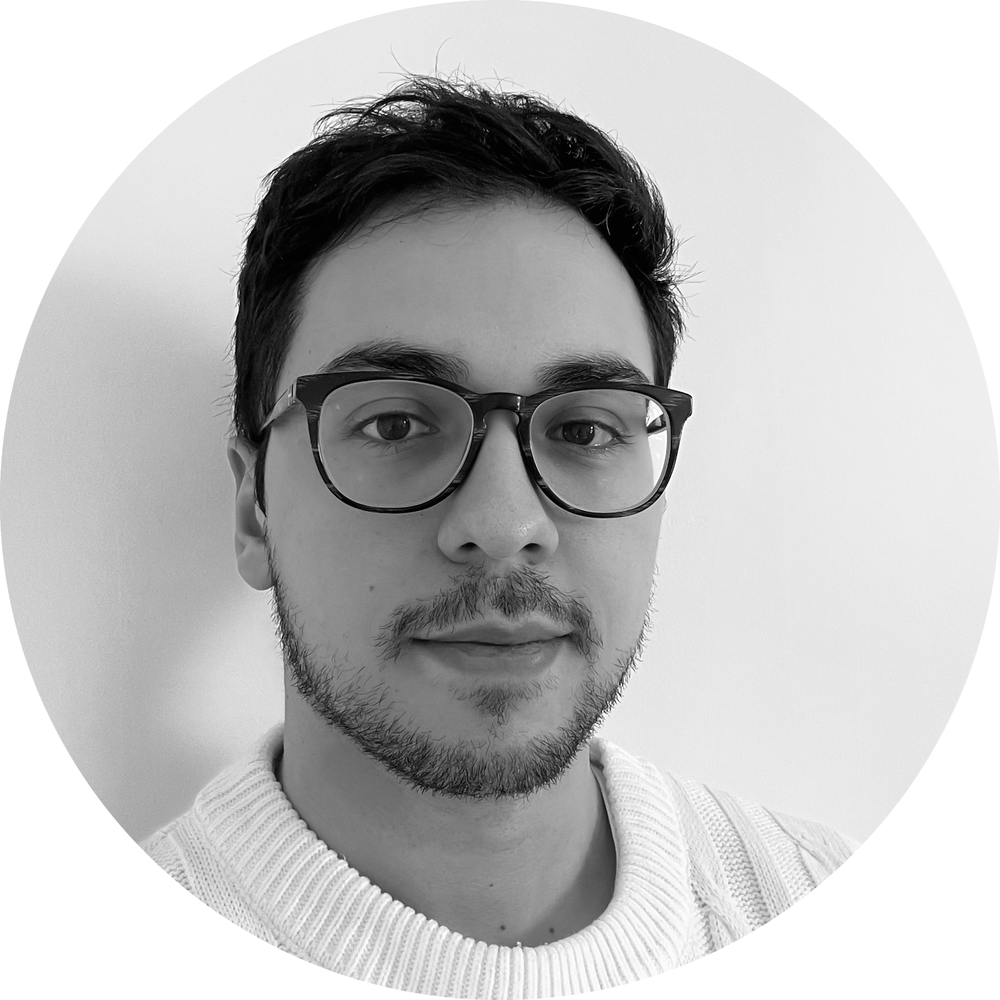

# Arman OZTURK

<!--  -->

---
## 👨🏽‍💻 Quelques mots me concernant

Arman, développeur FRONTEND depuis maintenant 6 ans. Je suis un passionné d’astronomie qui a fini dans le monde de la tech et du développement.

---

## 💻 Mes principaux challenges

En tant que développeur FRONTEND, les défis que j’apprécie sont variés comme par exemple :

- Rendre un produit performant et le plus UX friendly possible
- Maintenir une solution et la tester (que ce soit unitaire ou fonctionnel)
- Créer un projet avec la stack technique la plus adaptée possible afin d’en tirer le meilleur

---

## 🔗 Mes liens utiles

- Mon [CV](assets/resume.png)
- Mon [Linkedin](www.linkedin.com/in/armann-ozturk)